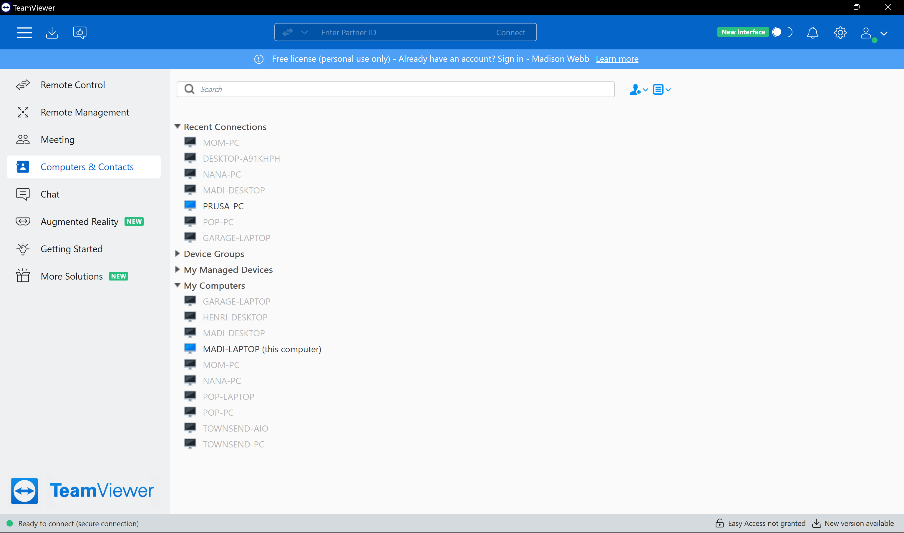
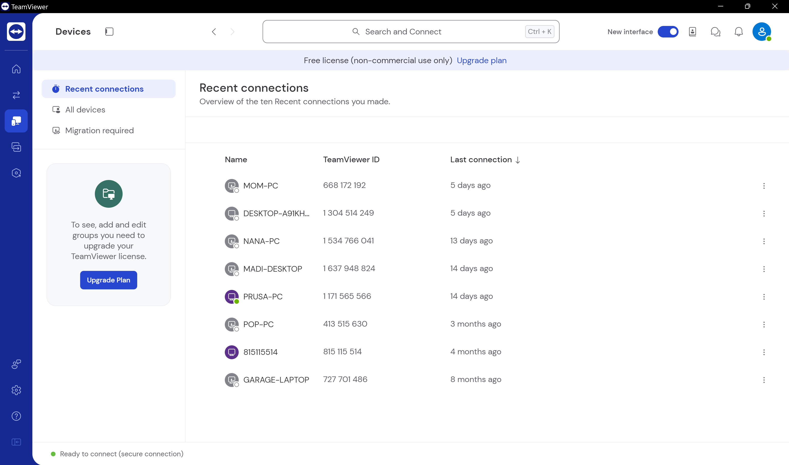
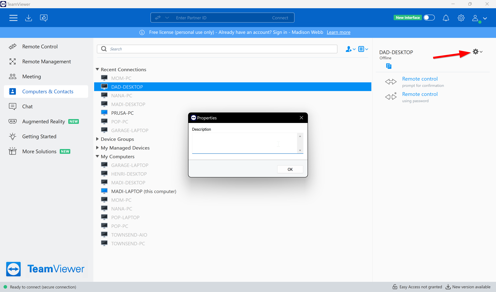
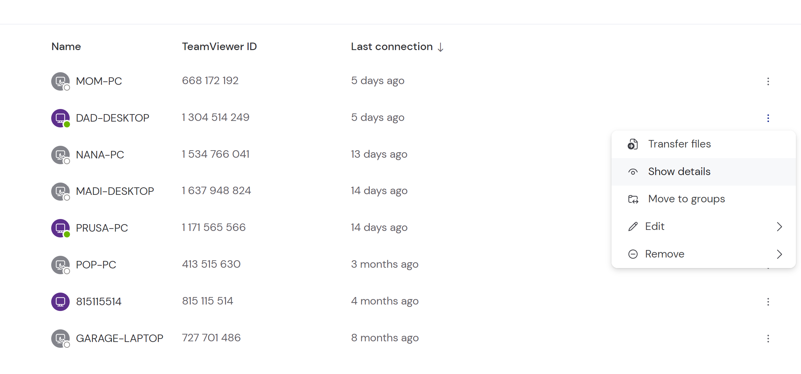
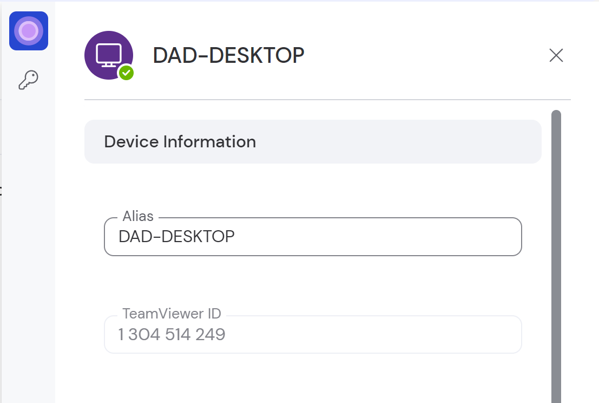
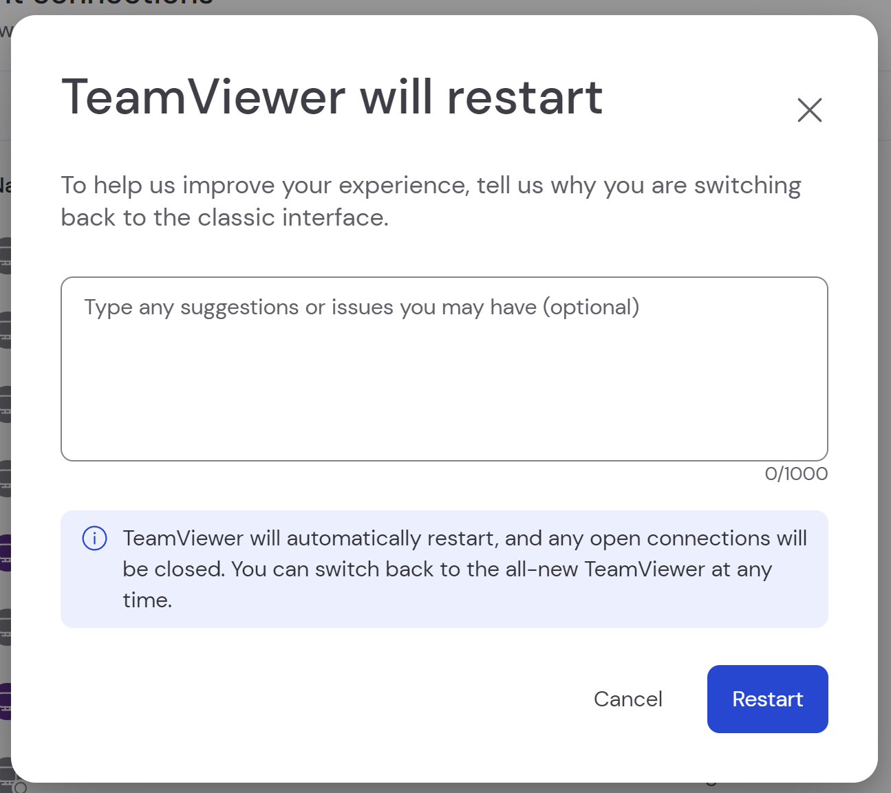

# TeamViewer - UI Changes (j02)

**By: Madison Webb**

**Date: 5/14/2024**

I use TeamViewer to provide technical assistance to my family. TeamViewer is a free software that’s used to allow remote connections between different devices, such as computers and mobile devices. Computers can connect to each other and mobile devices can remote into computers, too. Another reason I use TeamViewer is to quickly transfer files to my parents’ computer, while I’m already working on it and organizing their files.

I've been using TeamViewer for a few years now, and I’ve had all sorts of experiences and learning hiccups with it. It’s recently undergone a very large user interface (UI) redesign. The application still allows the user to move back and forth between the old and the updated UI. I’ve used lots of other applications for remote connections, and TeamViewer definitely has its pros and cons.

The recent UI redesign of TeamViewer caused a significant shift in my user experience. The software now allows toggling between the old and new user interfaces though, a choice that caters to **user preferences** but also introduces a layer of complexity. This duality in design reflects an interesting aspect of **user control and freedom**, offering the flexibility to stick with the familiar or venture into the new. Yet, this option can be potentially complicating the user experience for those less comfortable with change.

**Old Interface**

**New Interface**

In my latest home project, setting up my dad's new desktop, TeamViewer's redesigned interface came into play. I wanted to add his computer to my list of devices on TeamViewer, and also give his device a nickname to easily recognize it. Adding his desktop to my account was straightforward, a testament to the application's **efficiency**. However, assigning nicknames to devices for easy identification, brought up a significant discrepancy between my **mental model**, the way I expect the application to behave based on previous experiences, and the application's **conceptual model**, the way the application is actually designed to work.

My expectation, shaped by experiences with other software, was straightforward: right-click the desired computer, navigate to some form of device settings, and edit the nickname. This process, rooted in my **mental model** of how software typically functions, clashed with TeamViewer's approach. While I could right-click and access properties, the interface that presented itself, a "description" box, was confusing and unresponsive. 

**Old Interface Editing Nickname**

The inability to interact with the text box as anticipated is a clear example of a mismatch between the **user's expectations** and the application's design, impacting the **learnability** of the new interface. I'm a creature of habit, so I was still using the old interface. I spent about 10 minutes to try to figure out something as simple as assigning a nickname, assuming it was easy as I know I've done it before. I eventually gave up and decided to try the new interface.

This experience underscores the importance of consistency and standards in UI design. Users bring a set of expectations built on their interactions with other software; when those expectations are not met, frustration and inefficiency can ensue. To improve usability, software should leverage familiar patterns or clearly guide users through unique workflows.

With the new UI, TeamViewer has simplified the process of editing device nicknames, a change that significantly impacts the **usability** of the software. This improvement is just a small example of TeamViewer's commitment to evolving in response to **user feedback**, emphasizing **user control and freedom** within the application. The ability to easily edit nicknames without navigating through confusing menus or dealing with unresponsive text boxes enhances the **learnability** and **efficiency** of the software, allowing users to personalize their list of devices quickly and effortlessly.

**Editing Details**

Occasionally, there are workflows that are easier with the old UI. When toggling back the old UI interface, a window appears prompting the user for feedback on the new UI. The decision to include a feedback window upon reverting to the old UI highlights TeamViewer's strategic use of **user feedback** as a vital component of their UX strategy. This direct line of communication between users and developers encourages engagement, and allows the developers to enhance **error tolerence**. Error tolerance refers to the ability of a system or application to continue functioning correctly even when errors occur. This capability helps minimize the impact of user mistakes or unexpected issues, ensuring a more seamless and reliable user experience.

**User Feedback**

In summary, the redesign of TeamViewer's interface introduces both challenges and improvements. The ability to toggle between the old and new UI caters to different user preferences but also adds complexity. The mismatch between users' mental models and the application's conceptual model in the old UI highlights the importance of consistency in design. The improvements in the new UI, driven by user feedback, enhance usability and efficiency, demonstrating TeamViewer's commitment to evolving its software based on user needs.
